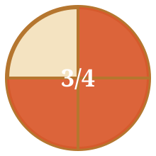

# ¿Qué es una fracción?

Una **fracción** expresa una parte de un todo que se ha dividido en partes iguales. Se escribe con dos números separados por una raya:

- El **numerador** (arriba) indica cuántas partes tomamos.
- El **denominador** (abajo) indica en cuántas partes iguales se ha dividido la unidad.

> Por ejemplo, en **3/4** dividimos una pizza en 4 trozos iguales y nos comemos 3.



## Tipos de fracciones

| Tipo | Condición | Ejemplo |
|------|-----------|---------|
| Propia | numerador < denominador | 2/5 |
| Impropia | numerador > denominador | 7/4 |
| Igual a la unidad | numerador = denominador | 6/6 |

## Fracciones equivalentes

Dos fracciones son **equivalentes** si representan la misma cantidad. Se obtienen multiplicando o dividiendo numerador y denominador por el mismo número:

```
1/2 = 2/4 = 3/6 = 4/8
```

## Comparar fracciones

1. Si tienen el **mismo denominador**, es mayor la de mayor numerador.
2. Si tienen el **mismo numerador**, es mayor la de menor denominador.
3. Si no, las pasamos a **común denominador** y comparamos.

Prueba la simulación interactiva para ver cómo cambia la fracción al mover los controles, y después haz el test para comprobar lo que has aprendido.
